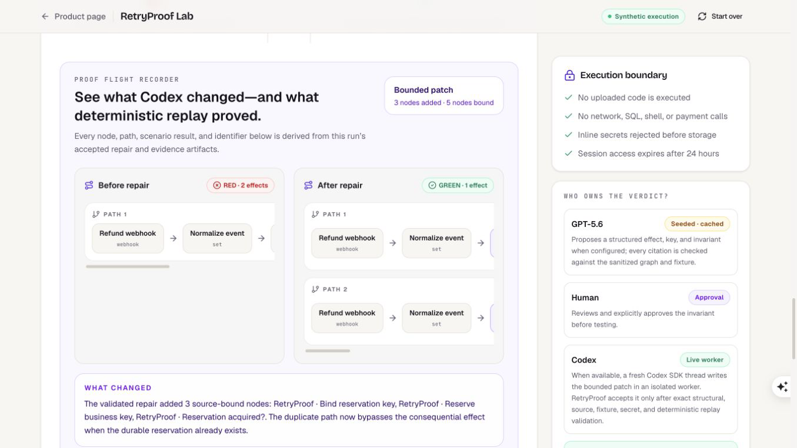
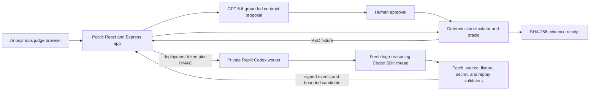

# RetryProof — OpenAI Build Week 2026

> **Hosted judge path:** [marmarlabs.com/retryproof/lab](https://marmarlabs.com/retryproof/lab/)  
> **Two-minute demo:** [youtu.be/4Oaie-WLKAc](https://youtu.be/4Oaie-WLKAc)
> **Category:** Developer Tools  
> **Production source:** submitted baseline `2dd084c`; reviewed Proof Flight Recorder release `9f8a2d6` plus mobile containment fix `6a1640b`

RetryProof reproduces a retry-sensitive automation failure, asks GPT-5.6 to propose a grounded reliability contract, requires human approval, and lets a fresh Codex SDK thread prepare one bounded repair. Deterministic validators—not either model—own every red or green verdict.

### No-account judge path

1. Open the hosted lab; no account or rebuild is required.
2. Select **Load seeded workflow**, then **Analyze retry risk**. Loading alone stays on Import.
3. Inspect the explicitly labeled seeded GPT-5.6-informed contract and approve the at-most-once invariant.
4. Run the deterministic suite and inspect the red timeout trace: one event, two deliveries, two mock effects.
5. Select **Repair with live Codex** once and allow the private worker to finish (typically 1–3 minutes, up to about 6 within the fail-closed budget).
6. Replay the identical suite and inspect `2 → 1` in the data-derived Proof Flight Recorder, the evidence receipt, and the explicit claim limitation.

The seeded analysis is deliberately cached and labeled for reproducibility; supported custom uploads exercise the live GPT-5.6 path. RetryProof never executes uploaded workflow code, makes real payment/network/SQL/shell calls, or claims production exactly-once safety.



| Same declared run | Before repair | After accepted repair |
| --- | ---: | ---: |
| Synthetic deliveries | 2 | 2 |
| Mock refund effects for one event | 2 | 1 |
| Human-approved at-most-once invariant | **Fail** | **Pass** |
| Real external actions | 0 | 0 |

### Why this is more than a webhook mock

A request replay alone can show that an endpoint was called twice. RetryProof tracks business-keyed effects across four declared fault phases, binds an accepted repair to the exact failing source and fixture, translates the patched graph, and reruns the identical schedule under a deterministic oracle. The models help discover and repair the contract; they never get to declare success.

### Hosted architecture and trust boundary



The worker receives no application database, billing, GitHub, or auth credentials. `credential-proxy.ts` gives each run a per-run ephemeral loopback credential proxy. The inline JSON input envelope escapes `<` as `\\u003c` so untrusted node text cannot close its data fence. The regression fixture is bound by trusted worker code and is deliberately excluded from the model output schema. Codex runs at high reasoning in a read-only sandbox with network, web search, and interactive approval disabled. Ordered fail-closed limits keep the 300s proxy, 330s turn abort, 345s hard-settle deadline, 360s public client, and 390s live test from racing each other.

### How Codex accelerated the build

Codex was used throughout the product, not as a final code generator: importer and simulator implementation, strict schemas, repair-contract design, private-worker debugging, regression tests, Replit deployment recovery, documentation, and production verification. The final recorder release used deliberately separate roles: one implementation agent wrote the bounded diff, an independent technical/security agent challenged data binding and untrusted-graph traversal, and a separate judge-experience agent challenged the visible claims and story. The false first draft phrase “cryptographic proof chain” was rejected because the receipt does not directly include the displayed plan hash; the shipped UI honestly calls them independent **Evidence references**. Deterministic tests and independent review—not the authoring agent’s preference—decided whether the change could merge.

## Production monorepo

MarMar Labs is a self-funded software lab building small, practical tools for builders.

[marmarlabs.com](https://marmarlabs.com)

This repo powers the MarMar Labs website and the NeverGuess application. The public site is now a product portfolio, not a one-product landing page.

## Products

### RetryProof

RetryProof is a workflow flight test for consequential n8n automations. It reproduces retry and crash failures under declared deterministic fault models, keeps invariant approval human-controlled, and lets the simulator and validator own every pass/fail verdict.

- Product page: `/retryproof`
- Live judge lab: `/retryproof/lab` on [marmarlabs.com](https://marmarlabs.com/retryproof/lab)
- Source repo: this public judge snapshot (`artifacts/neverguess/src/pages/retryproof-lab.tsx`, `artifacts/api-server/src/routes/retryproof.ts`, and `artifacts/retryproof-codex-worker`)

RetryProof runs as a namespaced product inside this deployment. It does not use NeverGuess auth or billing. Its anonymous 24-hour sessions live in the dedicated `retryproof_sessions` table, admission counters live in `retryproof_admission_buckets`, and its API is isolated under `/api/retryproof/v1/*`.

### NeverGuess

NeverGuess is an AI change-preflight tool. Give it a GitHub repo, an optional live URL, and a proposed change in plain English. It produces a structured report before another coding agent touches the code:

- stack and architecture signals
- risky assumptions and likely breakpoints
- acceptance criteria
- safer prompt pack for coding agents
- rollout and rollback notes
- public share links at `/r/:slug`
- Markdown export

NeverGuess is the only product in this repo that needs account/auth UI. The site header shows `Sign in` and the audit CTA only on `/neverguess`.

### stui

stui is a tiny Streamlit-inspired Python framework for terminal-native apps.

- PyPI distribution: `stui-terminal`
- Import package: `import stui as st`
- CLI: `stui run app.py`
- Current public release shown on the site: `1.0.0`
- Product page: `/stui`
- Source repo: [marmar9615-cloud/stui-terminal](https://github.com/marmar9615-cloud/stui-terminal)
- PyPI: [stui-terminal](https://pypi.org/project/stui-terminal/)

The stui page uses the real terminal screenshot asset at `artifacts/neverguess/public/products/stui/stui-model-demo.png`.

## What Lives Here

```text
artifacts/
  neverguess/      React + Vite frontend for the website and NeverGuess app
  api-server/      Express API for audits, auth, sharing, billing, and analysis
  mockup-sandbox/  Internal design preview sandbox
lib/
  api-spec/        OpenAPI source of truth
  api-zod/         Generated Zod schemas
  api-client-react/Generated TanStack Query hooks
  db/              Drizzle schema and database client
  replit-auth-web/ Shared Replit Auth web helpers
scripts/          Repo scripts
```

## Main Routes

| Path | Purpose |
| --- | --- |
| `/` | MarMar Labs portfolio homepage |
| `/retryproof` | RetryProof public product page and live judge-app link |
| `/retryproof/lab` | Complete anonymous RetryProof red-to-green flight test |
| `/neverguess` | NeverGuess public product page and only marketing page with auth/audit CTAs |
| `/stui` | stui public product page |
| `/pricing` | NeverGuess pricing |
| `/about` | Company/founder story |
| `/contact` | Contact links |
| `/status` | Public service status |
| `/changelog` | Site and product changelog |
| `/privacy`, `/terms` | Legal pages |
| `/login` | Replit Auth sign-in for NeverGuess |
| `/app` | NeverGuess dashboard |
| `/audits/new`, `/audits/:id` | Create and view NeverGuess audits |
| `/r/:slug` | Public share links for completed NeverGuess reports |

## Stack

- Frontend: React, Vite, Tailwind CSS v4, shadcn-style UI primitives, wouter, TanStack Query
- API: Express 5, TypeScript, Drizzle ORM, OpenRouter through Replit AI Integrations, Playwright smoke checks
- Database: PostgreSQL through `@workspace/db`
- Auth: Replit Auth for NeverGuess only
- Billing: Stripe for NeverGuess Pro
- API contract: OpenAPI in `lib/api-spec`, generated clients in `lib/api-zod` and `lib/api-client-react`

This is a pnpm monorepo intended to deploy cleanly on Replit.

## Supported Platforms

- Hosted judge experience: any current desktop browser with JavaScript and cookies enabled; no account or rebuild is required.
- Local development: macOS or Linux with Node.js 20.x and pnpm 9.x, plus PostgreSQL for database-backed API flows.
- Production: the public React/Express application runs on Replit Autoscale; the isolated live Codex worker runs as a separate private Replit Reserved VM deployment.

Windows is not part of the verified local-development matrix. Judges should use the hosted lab at [marmarlabs.com/retryproof/lab](https://marmarlabs.com/retryproof/lab/) unless they specifically want to inspect or run the repository.

## Local Development

Use pnpm. The repo intentionally blocks npm/yarn installs.

```sh
pnpm install
pnpm --filter @workspace/neverguess run dev
```

That starts the frontend at:

```text
http://localhost:5173/
```

For the API:

```sh
pnpm --filter @workspace/api-server run dev
```

## Replit Setup

On Replit, the workflows are configured around the frontend and API artifacts.

1. Open the repo in Replit.
2. Let Replit provision Postgres and set `DATABASE_URL`.
3. Start the `artifacts/api-server` API workflow and the `artifacts/neverguess` web workflow.
4. Add production secrets for NeverGuess analysis, auth, billing, and share URLs as needed.
5. Republish after pushing changes to `main`.

## Environment Variables

| Variable | Required | Used by | Purpose |
| --- | --- | --- | --- |
| `DATABASE_URL` | yes | API | Postgres connection |
| `PORT` | yes | API/Replit | Service port |
| `API_PROXY_TARGET` | no | web development server | Same-origin `/api` proxy target, defaults to `http://127.0.0.1:8080` |
| `SESSION_SECRET` | yes | API | Signs RetryProof anonymous-session tokens and supports Replit Auth sessions |
| `RETRYPROOF_TRUST_PROXY` | yes on one-hop Replit production | API | Set to `1` only when the deployment is behind the documented one-hop trusted proxy; enables per-client anonymous-session admission limits through Express `req.ip` |
| `REPL_ID`, `REPLIT_DOMAINS`, `ISSUER_URL` | yes for auth | API/web | Replit Auth |
| `PUBLIC_APP_URL` | yes in production | API | Canonical origin for share links and redirects |
| `AI_INTEGRATIONS_OPENROUTER_BASE_URL` | no | API | Replit AI Integrations OpenRouter base URL |
| `AI_INTEGRATIONS_OPENROUTER_API_KEY` | no | API | Replit AI Integrations OpenRouter key |
| `OPENROUTER_MODEL` | no | API | Analysis model, default from `analysis-runner.ts` |
| `OPENROUTER_REASONING_EFFORT` | no | API | Reasoning effort: `minimal`, `low`, `medium`, `high`, or `xhigh` |
| `OPENAI_API_KEY` | no | RetryProof API | Enables live, read-only GPT-5.6 risk-contract proposals for supported custom workflows |
| `OPENAI_ORGANIZATION_ID` | no | RetryProof API | Scopes the OpenAI client to the configured organization |
| `OPENAI_PROJECT_ID` | no | RetryProof API | Scopes the OpenAI client to the configured project |
| `OPENAI_ANALYSIS_MODEL` | no | RetryProof API | RetryProof analysis model, defaults to `gpt-5.6-sol` |
| `RETRYPROOF_CODEX_WORKER_URL` | no | RetryProof API | HTTPS origin of the isolated live Codex repair worker |
| `RETRYPROOF_CODEX_WORKER_ACCESS_TOKEN` | yes for a private Replit worker | RetryProof API only | Replit production External Access Token used only as the `Authorization: Bearer` gateway credential; never sent in a repair body or artifact |
| `RETRYPROOF_CODEX_WORKER_SECRET` | yes for live repair | RetryProof API + worker | Random HMAC secret of at least 32 characters used to authenticate and bind worker requests, progress events, and candidates |
| `CODEX_MODEL` | no | RetryProof worker | Codex repair model, defaults to `gpt-5.6-sol` |
| `GITHUB_TOKEN` | no | API | Pulls real repo metadata and files for analysis |
| `REPLIT_PLAYWRIGHT_CHROMIUM_EXECUTABLE` | no | API | Enables live-app smoke screenshot checks |
| `SEED_DEMO` | no | API | Seeds the `/r/demo` report when `true` |
| `CORS_ORIGINS` | no | API | Comma-separated allowed origins override |
| `STRIPE_SECRET_KEY` | yes for billing | API | Stripe server client |
| `STRIPE_WEBHOOK_SECRET` | yes for billing | API | Stripe webhook verification |
| `VITE_STRIPE_PRO_URL` | no | web | Monthly Pro payment link override |
| `VITE_STRIPE_PRO_ANNUAL_URL` | no | web | Annual Pro payment link override |

Use Replit Secrets for real values. Do not commit secrets.

## Demo Mode

NeverGuess stays demoable without optional integrations:

- no `GITHUB_TOKEN`: uses the bundled demo repo fixture
- no OpenRouter integration vars: returns the bundled demo report
- no Playwright Chromium path: live smoke check is skipped and marked as skipped
- `SEED_DEMO=true`: seeds a stable public demo report at `/r/demo`

RetryProof's `/retryproof/lab` judge path is intentionally self-contained:

- a supported custom n8n export plus a synthetic fixture can complete the same analyze, approve, fail, repair, replay, and evidence-export path as the seeded workflow;
- when `OPENAI_API_KEY` is configured, GPT-5.6 proposes the custom risk contract through strict structured output; every cited effect and key is grounded against the sanitized graph and fixture before human approval;
- unavailable, failed, or ungrounded model output falls back to a deterministic proposal that is labeled as a fallback rather than represented as a live model response;
- when the isolated worker variables are configured, the repair step launches a fresh Codex SDK thread and relays signature-verified progress heartbeats to the lab; RetryProof accepts the candidate only after exact source, patch, fixture, secret, and deterministic replay validation;
- when that worker is unavailable, users can choose the clearly labeled validated fallback; it is never represented as a fresh Codex run;
- the seeded path's locally derived GPT-5.6-informed contract and the bounded Codex-validated repair strategy are labeled honestly;
- both templates identify the exact canonical RetryProof repository commit where the live GPT-5.6 and Codex verification paths are implemented and recorded;
- duplicate delivery, timeout-after-effect, rate-limit, and partial-failure retry scenarios run live in the deterministic simulator;
- the patch validator, identical-suite replay, and evidence ZIP export run live for seeded and supported custom workflows;
- no real workflow code, network, SQL, shell, or payment call is executed;
- uploads and fixtures are size-bounded, sanitized, and rejected when inline-secret paths are found; raw uploads are never persisted;
- anonymous session access expires after 24 hours, and expired sanitized rows are removed by request-time cleanup.

## RetryProof live Codex worker

The public RetryProof product remains part of this MarMar Labs application. Live Codex repair runs as a narrowly scoped backend service from `artifacts/retryproof-codex-worker` so it does not receive the application database, authentication, Stripe, GitHub, or other product secrets.

Build and start that service from this repository with:

```sh
pnpm install --frozen-lockfile
pnpm --filter @workspace/retryproof-codex-worker run build
pnpm --filter @workspace/retryproof-codex-worker run start
```

For the Replit-hosted production path, publish this worker as a separate **Private Reserved VM** web-server deployment with one exposed port. Configure only `PORT`, `OPENAI_API_KEY`, optional OpenAI organization/project identifiers, optional `CODEX_MODEL`, and `RETRYPROOF_CODEX_WORKER_SECRET` on the worker. Then create a production [Replit External Access Token](https://docs.replit.com/references/publishing/external-access-tokens) and configure its value only as `RETRYPROOF_CODEX_WORKER_ACCESS_TOKEN` on the public API, alongside the worker HTTPS origin and the shared HMAC secret. The public API sends the Replit token only in the `Authorization` header; the independent HMAC signature still binds every request, progress event, and candidate and supplies replay protection.

Replit production access tokens are tied to a published deployment. After republishing the private worker, create a replacement production access token, update the public API secret, and republish the public app before declaring live repair ready. The worker disables network access inside the Codex repair workspace, exposes a non-sensitive `/ready` endpoint behind the private deployment gateway, accepts only HMAC-authenticated repair requests, and never receives raw uploaded workflow files or application credentials. Keeping the worker in a separate Replit project separates its app-level secrets and deployment lifecycle; Replit documents that artifacts inside one project share the backend, database, secrets, and deployment.

## How Codex and GPT-5.6 were used

Codex accelerated the implementation across the importer, deterministic simulator, API boundaries, private worker, product UI, tests, documentation, and deployment debugging. It helped turn the product contract into source changes, generated focused regression tests, and traced failures across the public API, Replit private gateway, Codex SDK child process, and deterministic validator. The resulting changes remained human-reviewed and were accepted only after the repository test suites and production red-to-green journey passed.

GPT-5.6 is part of the product rather than the verdict system. For a supported custom workflow it proposes a structured side effect, business key, invariant, and supported scenarios from the sanitized graph. Grounding code rejects invented nodes or paths, and the user must approve the contract before any fault simulation runs. The seeded judge flow uses an explicitly labeled cached GPT-5.6-informed contract so it remains repeatable; judges can upload the bundled supported workflow and synthetic fixture to exercise the live analysis path.

The key product, engineering, and design decisions stayed human-owned:

- narrow support to a declared subset of n8n instead of pretending to execute arbitrary workflows;
- keep workflow side effects deterministic and mock-only, with no real network, SQL, shell, payment, or uploaded-code execution;
- require explicit human approval before testing the invariant;
- give every pass/fail verdict to deterministic software, never GPT-5.6 or Codex;
- bind a Codex candidate to the exact sanitized source, approved invariant, failing fixture, and identical replay suite;
- run live Codex in a separate private deployment with network/web search disabled and accept only authenticated, signature-verified events;
- preserve an explicit validated fallback without ever presenting it as a fresh model run;
- limit the claim to the approved invariant under the declared fault model, not exactly-once execution or production safety.

## OpenAI Build Week judge path

1. Open [the hosted RetryProof lab](https://marmarlabs.com/retryproof/lab/) in a clean browser session.
2. Select **Load seeded workflow**, then **Analyze retry risk**. Loading alone intentionally remains on the Import step.
3. Inspect and approve the at-most-once invariant.
4. Run the four-scenario deterministic suite and inspect the red timeout-after-effect trace with two mock effects.
5. Select **Repair with live Codex** once and follow the signature-verified progress feed.
6. Confirm **Fresh Codex** provenance, the bounded eight-operation/five-node candidate, and all deterministic validator checks.
7. Replay the identical suite and confirm the same event, seed, scenario, and two deliveries change from two effects/fail to one effect/pass.
8. Download the evidence ZIP and inspect its source, fixture, trace, patch, provenance, and limitations.

The hosted path needs no test account and never executes uploaded workflow code or real integrations.

## Development Commands

Frontend:

```sh
pnpm --filter @workspace/neverguess run typecheck
pnpm --filter @workspace/neverguess run test
pnpm --filter @workspace/neverguess run build
```

API:

```sh
pnpm --filter @workspace/api-server run typecheck
pnpm --filter @workspace/api-server run test
pnpm --filter @workspace/api-server run build
```

Whole repo:

```sh
pnpm run typecheck
pnpm run build
```

## Codegen And Database

After editing `lib/api-spec/openapi.yaml`, regenerate generated API packages:

```sh
pnpm --filter @workspace/api-spec run codegen
```

After editing Drizzle schema files under `lib/db/src/schema`, push schema changes:

```sh
pnpm --filter @workspace/db run push-force
```

## Deploying

Recommended target: Replit Autoscale Deployment.

1. Push the latest `main`.
2. Republish from Replit.
3. Promote or attach the production Postgres database.
4. Confirm production secrets are present.
5. Set `PUBLIC_APP_URL` to the deployed origin, for example `https://marmarlabs.com`.

The frontend builds statically. The API runs as a Node service and binds to `PORT`.

## Brand And Assets

Brand assets live under `artifacts/neverguess/public/brand/`.

Product assets live under `artifacts/neverguess/public/products/`.

Theme variables and utilities live in `artifacts/neverguess/src/index.css`.

## License

MIT. See [LICENSE](LICENSE).
